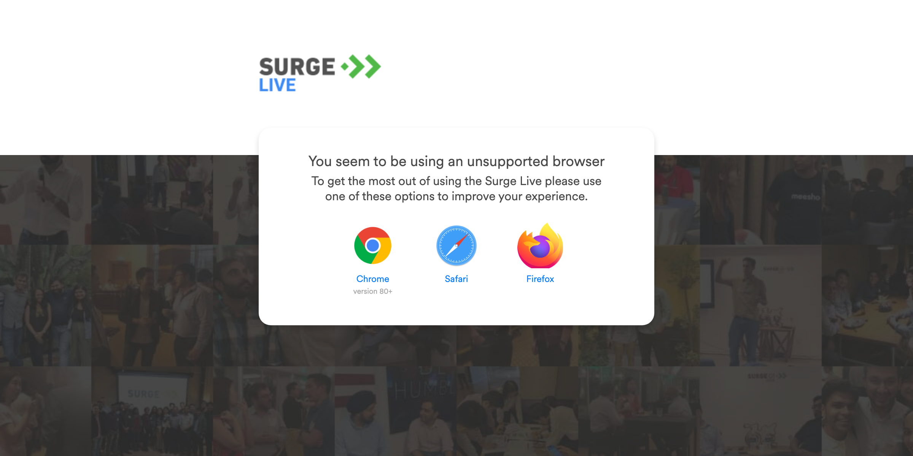

# Dev Surge Automation

### Maven Command to trigger Automation

##  UI Mode 

###  Credential  Switching : Different Users
#### mvn clean test -Dusername="dev17.india@sequoiacap.com" -Dpassword="@Terminator1" 
#### mvn clean test -Dusername="dev17.india@sequoiacap.com" -Dpassword="@Terminator1" 

###  Browser Switching :  chrome And safari
#### mvn clean test -Dusername="dev17.india@sequoiacap.com" -Dpassword="@Terminator1"  -Dbrowser="chrome"
#### mvn clean test -Dusername="dev17.india@sequoiacap.com" -Dpassword="@Terminator1"  -Dbrowser="safari"

###  Environment Switching : Dev and test environment
#### mvn clean test -Dusername="dev17.india@sequoiacap.com" -Dpassword="@Terminator1" -DenvUrl="dev" -Dbrowser="chrome"
#### mvn clean test -Dusername="dev17.india@sequoiacap.com" -Dpassword="@Terminator1" -DenvUrl="test" -Dbrowser="safari"

### Default Configuration
#### browser = chrome
#### environment = dev
#### credentials = dev17.india@sequoiacap.com user

## Others Configuration
### Headless Mode/ Browser not supported by Dev Surge, 
#### mvn clean test -DheadlessBrowser="true"
#### If run in headless then Unsupported browser  appear and visible in report screenshot

